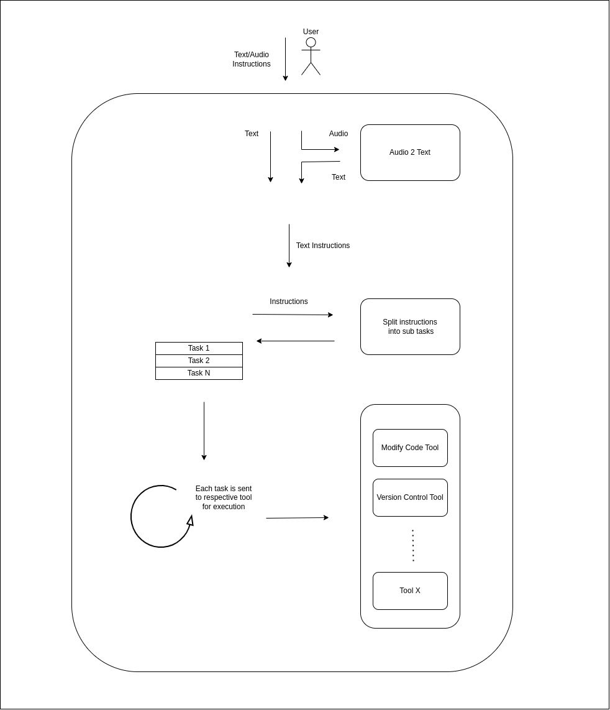

#  Shadow
Shadow is an Ai agent, built with LangChain, capable of performing code changes and version control. It accepts English instructions in text or audio format.

The long term vision of this project is to add a multi-tenant layer on top of it and expose it as a service. (Basically Code as a Service)

### Demo

https://github.com/m-a-r-i-b/shadow/assets/77619505/248bd3d8-b28d-4003-bc67-107298e8fc01

### High Level Architecture

### TODO
1) Improve code modification capabilities
2) Multi-file code modification
3) Multi-tenancy (Separate execution context for each user) 
4) Queue-ing mechanism for incoming requests

### Development History

Shadow initially started as a custom ReAct agent, but it was found to be difficult to steer the action inputs in the direction required. And given the fact that its operational enevlope is limited to coding and version control tasks, for now at least, an instruction tuned LLM with structured output parser seemed the right way to move forward. 
